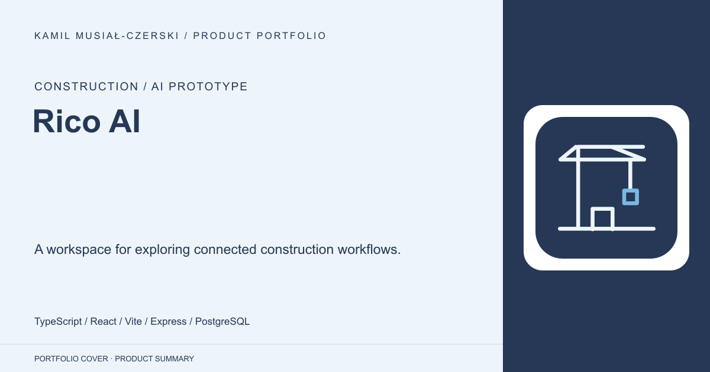
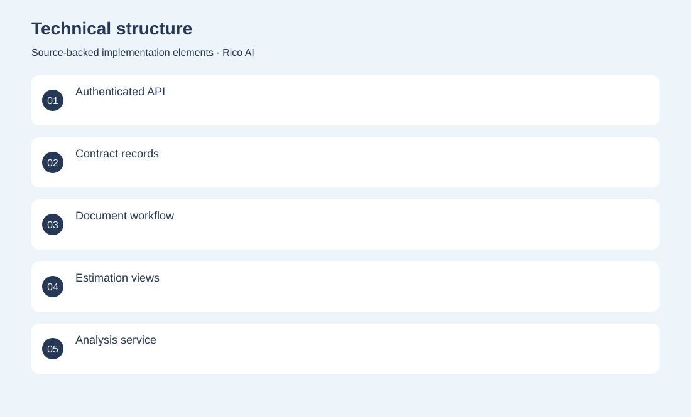
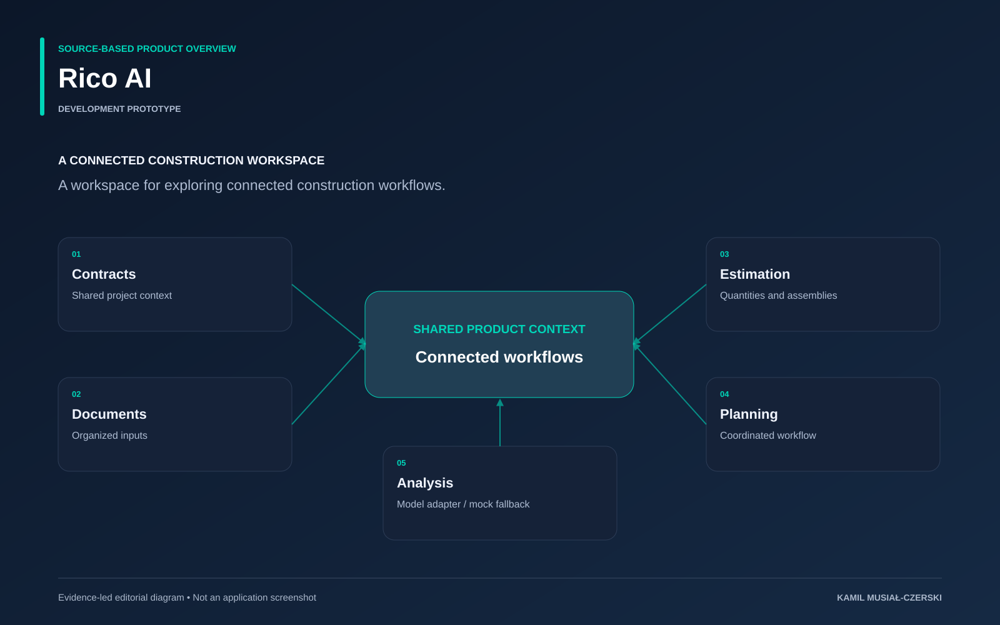

# Rico AI

A workspace for exploring connected construction workflows.

**Construction / AI prototype · Development prototype**

A React frontend and authenticated API connect project records to analysis and coordination views. Implemented authenticated construction workflows and document-analysis integration with an explicit demonstration fallback.

## Problem

Construction information spans separate documents and process stages that need a shared context.

## Solution

A React frontend and authenticated API connect project records to analysis and coordination views.

## My contribution

Implemented authenticated construction workflows and document-analysis integration with an explicit demonstration fallback.

## Technology

TypeScript; React; Vite; Express; PostgreSQL; Anthropic

## Technical structure

Authenticated API; Contract records; Document workflow; Estimation views; Analysis service

## AI capabilities

Document analysis adapter; Suggested clarification requests; Explicit mock fallback

## Visuals

Portfolio cover and new project marks are editorial artwork. Only product views explicitly identified as captures represent screenshots.

[Complete portfolio](../README.md)

