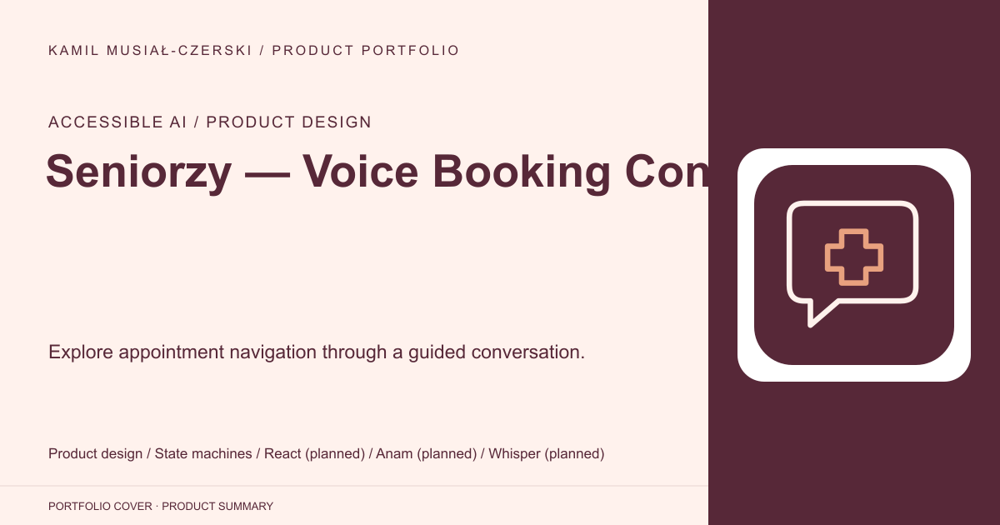
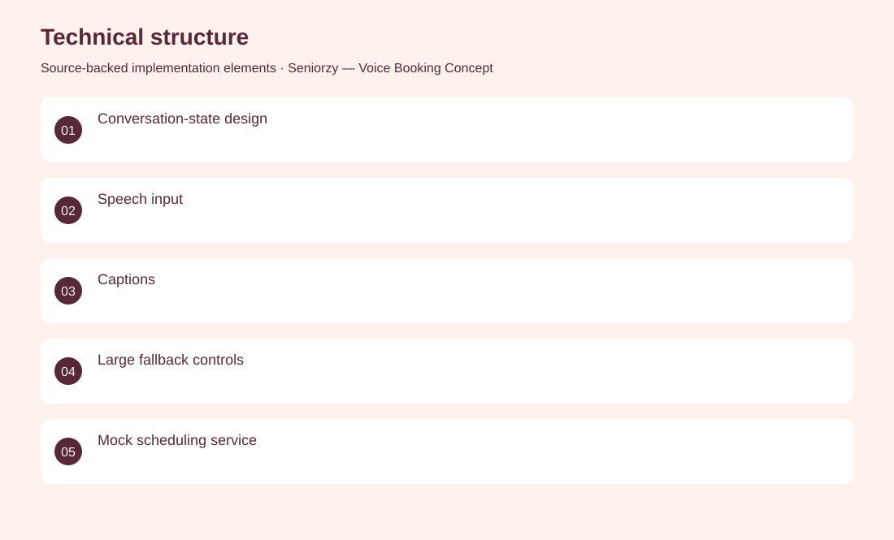
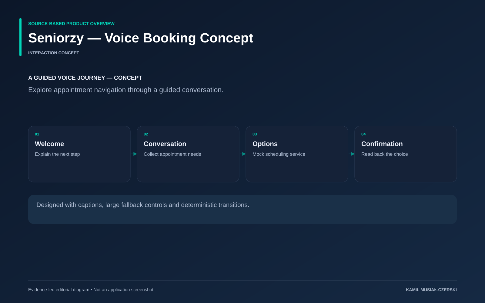

# Seniorzy — Voice Booking Concept

Explore appointment navigation through a guided conversation.

**Accessible AI / Product design · Interaction concept**

A documented conversational state machine guides a simulated booking journey with explicit confirmation steps. Designed the booking conversation, deterministic state transitions, captions and large fallback controls.

## Problem

Complex forms can make appointment navigation difficult for people with low digital confidence.

## Solution

A documented conversational state machine guides a simulated booking journey with explicit confirmation steps.

## My contribution

Designed the booking conversation, deterministic state transitions, captions and large fallback controls.

## Technology

Product design; State machines; React (planned); Anam (planned); Whisper (planned)

## Technical structure

Conversation-state design; Speech input; Captions; Large fallback controls; Mock scheduling service

## AI capabilities

Avatar interface design; Speech interaction design

## Visuals

Portfolio cover and new project marks are editorial artwork. Only product views explicitly identified as captures represent screenshots.

[Complete portfolio](../README.md)

