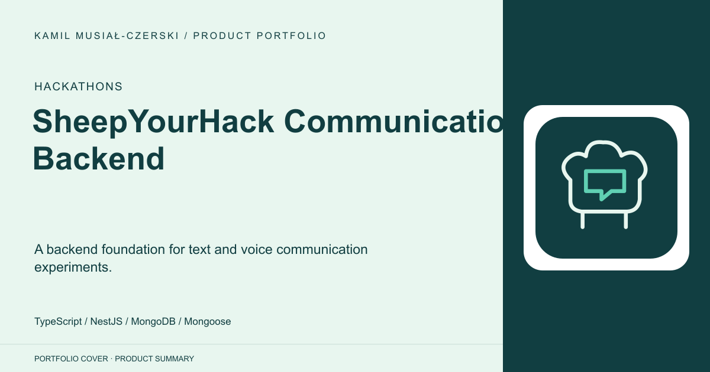
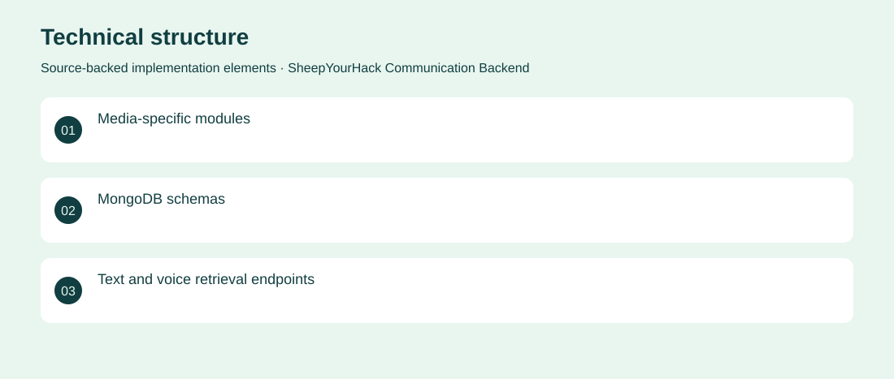

# SheepYourHack Communication Backend

A backend foundation for text and voice communication experiments.

**Hackathons · Archived partial hackathon prototype**

A hackathon backend organising text, voice, recordings and translation resources. NestJS modules and MongoDB models provide a structure for exploring accessible communication workflows. Created modular text, voice, recording and translation resources with initial retrieval endpoints. Archived partial hackathon prototype. No adoption, revenue or deployment claims are inferred from the repository.

## Problem

A communication prototype needs consistent storage and API boundaries for different media types.

## Solution

Created modular text, voice, recording and translation resources with initial retrieval endpoints.

## My contribution

Backend contribution to the hackathon prototype, covering service modules and persistence structure.

## Technology

TypeScript; NestJS; MongoDB; Mongoose

## Technical structure

Media-specific modules; MongoDB schemas; Text and voice retrieval endpoints

## Visuals

Portfolio cover and new project marks are editorial artwork. Only product views explicitly identified as captures represent screenshots.

[Complete portfolio](../README.md)
