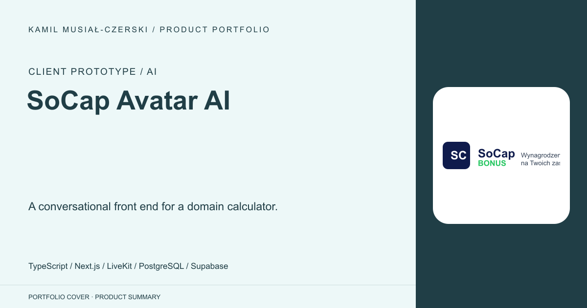
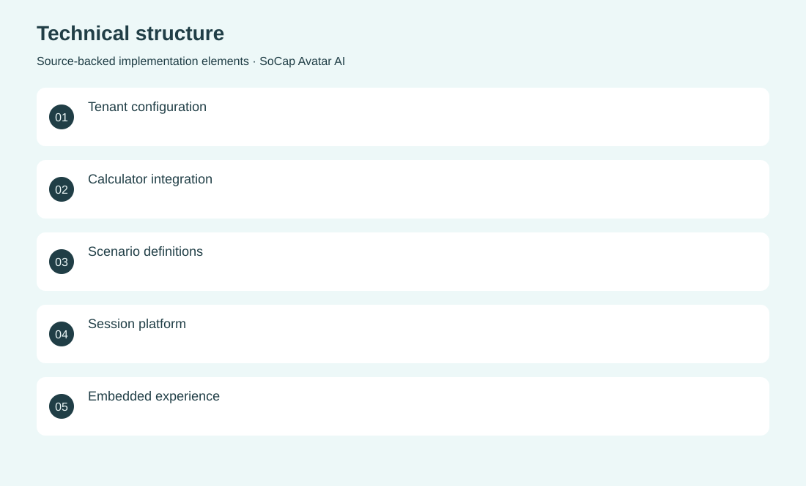
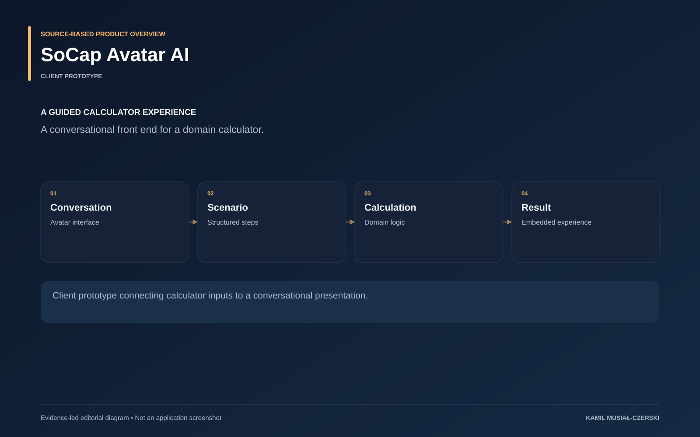

# SoCap Avatar AI

A conversational front end for a domain calculator.

**Client prototype / AI · Client prototype**

Tenant-specific calculation logic is connected to an avatar scenario and a reusable session platform. Connected SoCap calculation logic to guided avatar scenarios and an embedded client experience.

## Problem

A domain calculator can require explanation and guided input rather than isolated form fields.

## Solution

Tenant-specific calculation logic is connected to an avatar scenario and a reusable session platform.

## My contribution

Connected SoCap calculation logic to guided avatar scenarios and an embedded client experience.

## Technology

TypeScript; Next.js; LiveKit; PostgreSQL; Supabase

## Technical structure

Tenant configuration; Calculator integration; Scenario definitions; Session platform; Embedded experience

## AI capabilities

Conversational avatar; Guided scenario interaction

## Visuals

Portfolio cover and new project marks are editorial artwork. Only product views explicitly identified as captures represent screenshots.

[Complete portfolio](../README.md)

