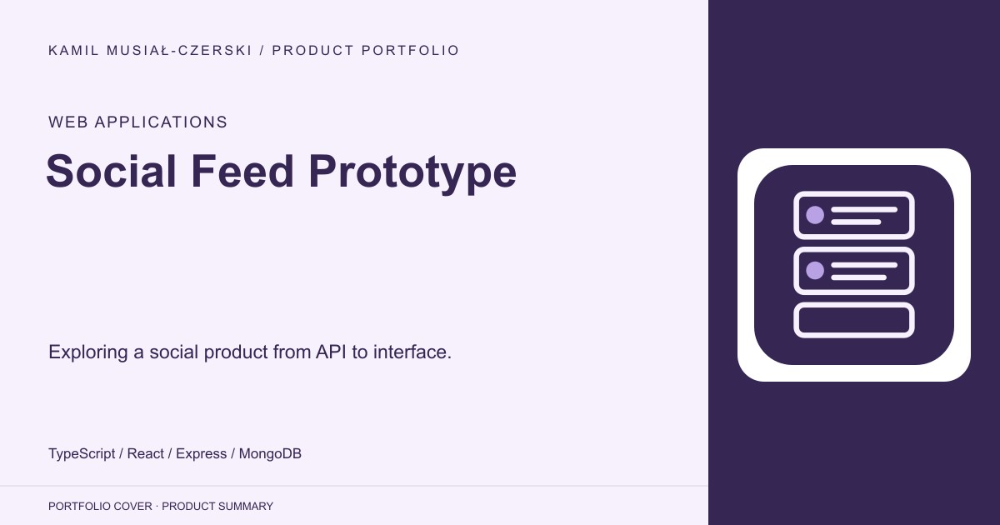
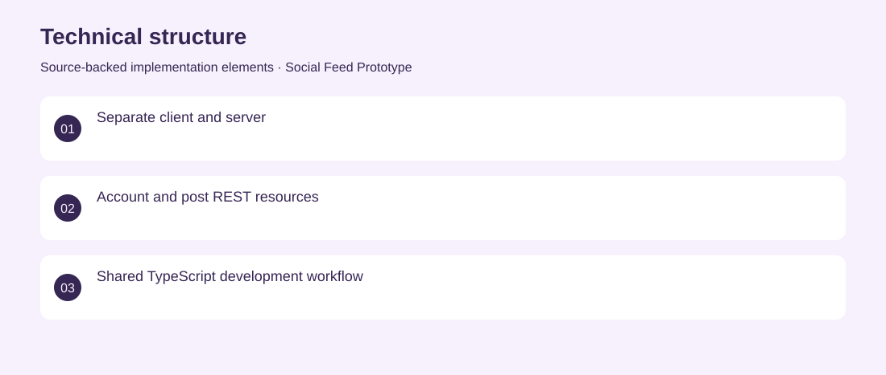

# Social Feed Prototype

Exploring a social product from API to interface.

**Web Applications · Archived partial prototype**

A self-directed social-feed prototype pairing a React interface with an Express API. The repository implements account and post foundations and an early publishing form. Created a client/server TypeScript structure with MongoDB models, authentication and post endpoints. Archived partial prototype. No adoption, revenue or deployment claims are inferred from the repository.

## Problem

A social feed requires account identity, persistent posts and a usable publishing interface to work together.

## Solution

Created a client/server TypeScript structure with MongoDB models, authentication and post endpoints.

## My contribution

Full-stack prototyping across API structure, persistence and initial React screens.

## Technology

TypeScript; React; Express; MongoDB

## Technical structure

Separate client and server; Account and post REST resources; Shared TypeScript development workflow

## Visuals

Portfolio cover and new project marks are editorial artwork. Only product views explicitly identified as captures represent screenshots.

[Complete portfolio](../README.md)
