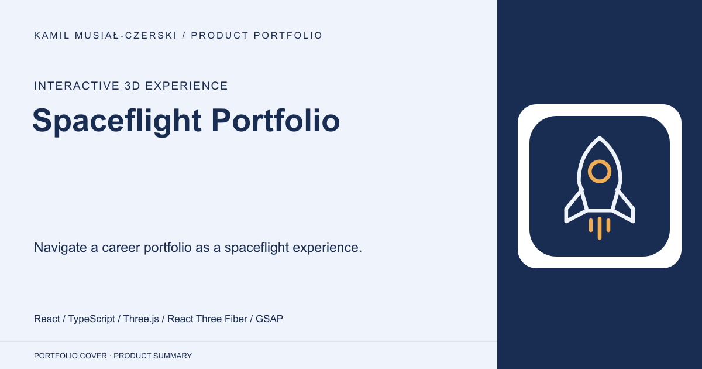
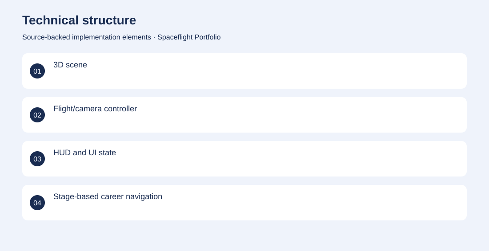
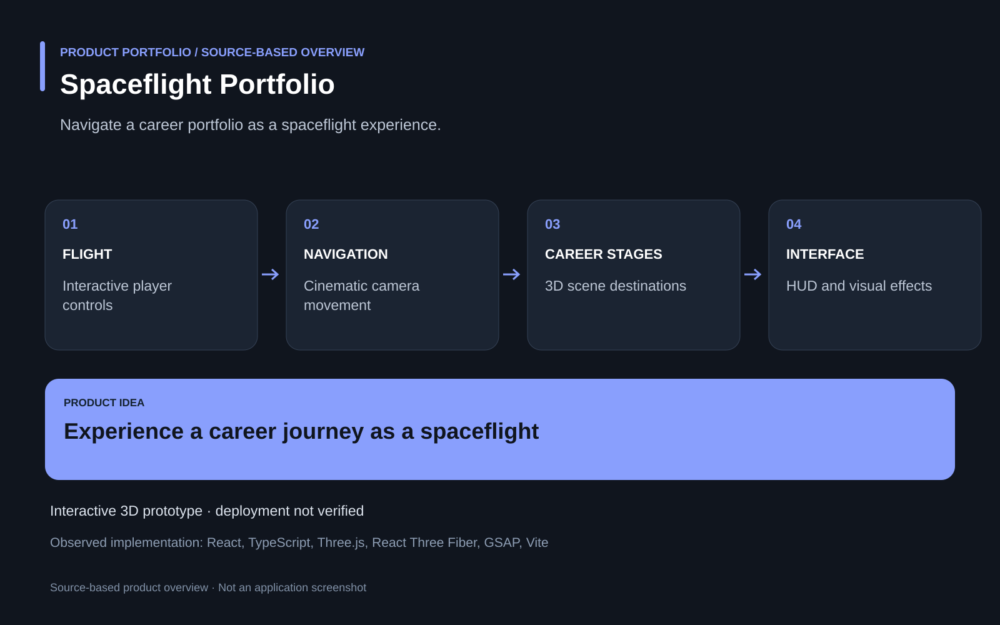

# Spaceflight Portfolio

Navigate a career portfolio as a spaceflight experience.

**Interactive 3D experience · Implemented interactive prototype; current public deployment is not verified.**

A conventional portfolio can make a broad development history feel static and disconnected.

An interactive 3D scene turns navigation into a spaceflight journey with cinematic camera movement, a player, stage objects and a heads-up display. Developed the React Three Fiber experience, navigation and camera systems, visual effects and portfolio interface.

Implemented interactive prototype; current public deployment is not verified.

## Problem

A conventional portfolio can make a broad development history feel static and disconnected.

## Solution

An interactive 3D scene turns navigation into a spaceflight journey with cinematic camera movement, a player, stage objects and a heads-up display.

## My contribution

Developed the React Three Fiber experience, navigation and camera systems, visual effects and portfolio interface.

## Technology

React; TypeScript; Three.js; React Three Fiber; GSAP; Vite

## Technical structure

3D scene; Flight/camera controller; HUD and UI state; Stage-based career navigation

## Visuals

Portfolio cover and new project marks are editorial artwork. Only product views explicitly identified as captures represent screenshots.

[Complete portfolio](../README.md)

