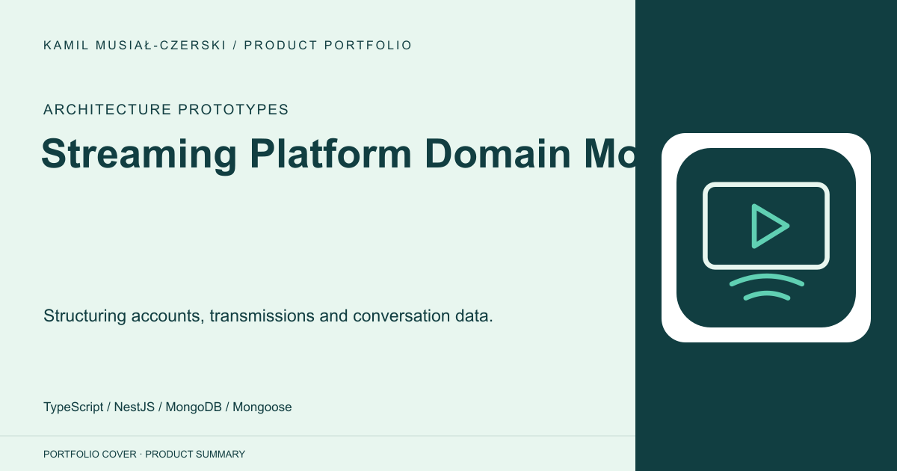
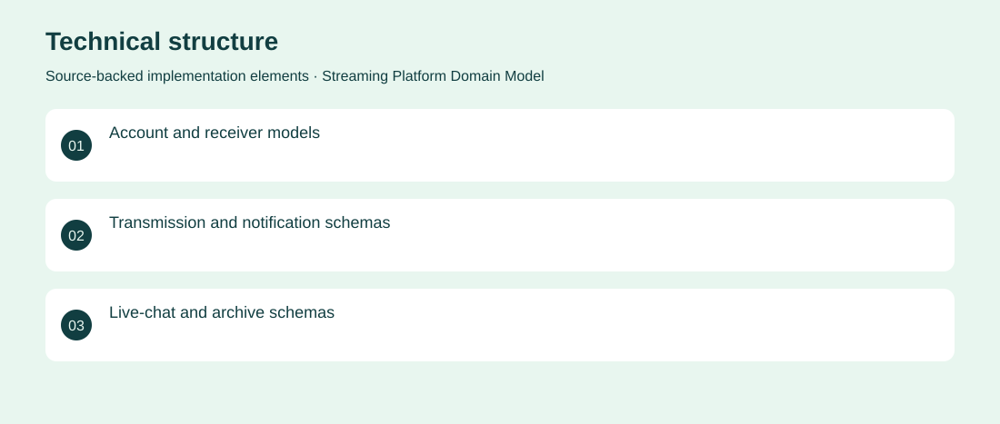

# Streaming Platform Domain Model

Structuring accounts, transmissions and conversation data.

**Architecture Prototypes · Archived domain-model prototype; operational services incomplete**

An early collaborative streaming-platform architecture prototype preserved on development branches. It defines accounts, transmissions, notifications, chat and archive schemas. Frontend and service handlers remain scaffolds, so no working streaming product is claimed. Created an initial NestJS/Mongoose domain structure across developer branches.

## Problem

A streaming service needs a shared model for viewers, senders, sessions and messages before real-time delivery can be implemented.

## Solution

Created an initial NestJS/Mongoose domain structure across developer branches.

## My contribution

Early architecture and data-modelling work represented in the repository; individual authorship and completed application delivery are not inferred.

## Technology

TypeScript; NestJS; MongoDB; Mongoose

## Technical structure

Account and receiver models; Transmission and notification schemas; Live-chat and archive schemas

## Visuals

Portfolio cover and new project marks are editorial artwork. Only product views explicitly identified as captures represent screenshots.

[Complete portfolio](../README.md)
