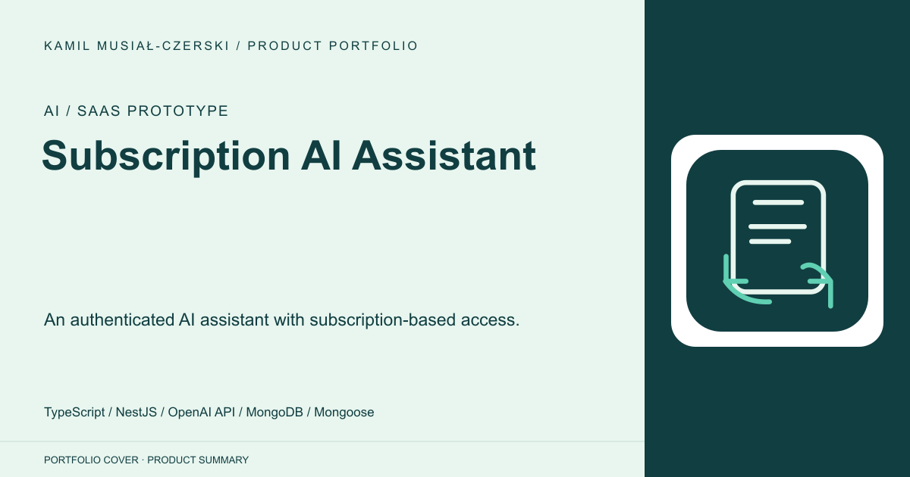
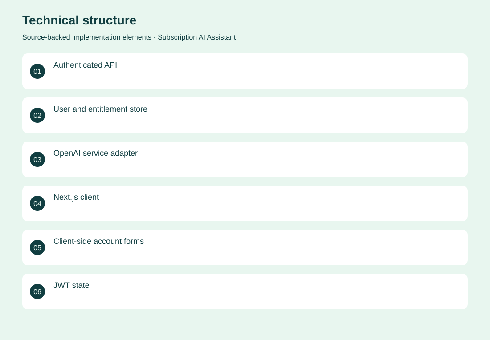
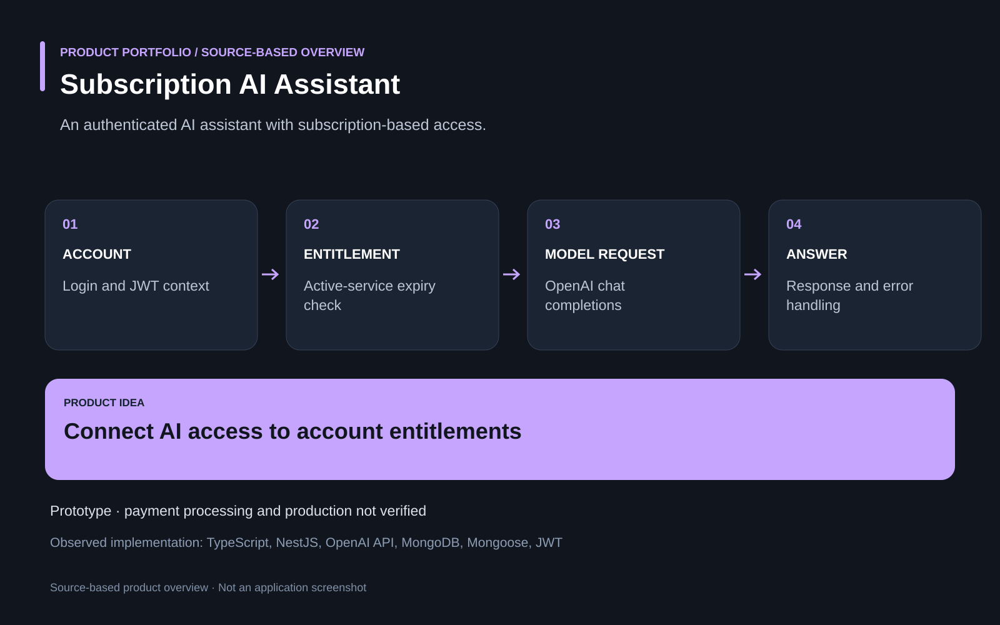

# Subscription AI Assistant

An authenticated AI assistant with subscription-based access.

**AI / SaaS prototype · Archived prototype. Subscription access checks exist; production billing, paid customers and deployment are not verified.**

An AI service needs to connect model access with user accounts and valid service entitlements.

A NestJS backend links authentication and user records to OpenAI chat completions, checking subscription state and expiry before generating an answer. Implemented account and authentication modules, service-entitlement checks and the OpenAI request workflow.

Archived prototype. Subscription access checks exist; production billing, paid customers and deployment are not verified.

## Problem

An AI service needs to connect model access with user accounts and valid service entitlements.

## Solution

A NestJS backend links authentication and user records to OpenAI chat completions, checking subscription state and expiry before generating an answer.

## My contribution

Implemented account and authentication modules, service-entitlement checks and the OpenAI request workflow.

## Technology

TypeScript; NestJS; OpenAI API; MongoDB; Mongoose; JWT; Next.js; React; Tailwind CSS; Zustand

## Technical structure

Authenticated API; User and entitlement store; OpenAI service adapter; Next.js client; Client-side account forms; JWT state; Authenticated route navigation

## AI capabilities

Subscription-gated OpenAI chat completion

## Visuals

Portfolio cover and new project marks are editorial artwork. Only product views explicitly identified as captures represent screenshots.

[Complete portfolio](../README.md)

