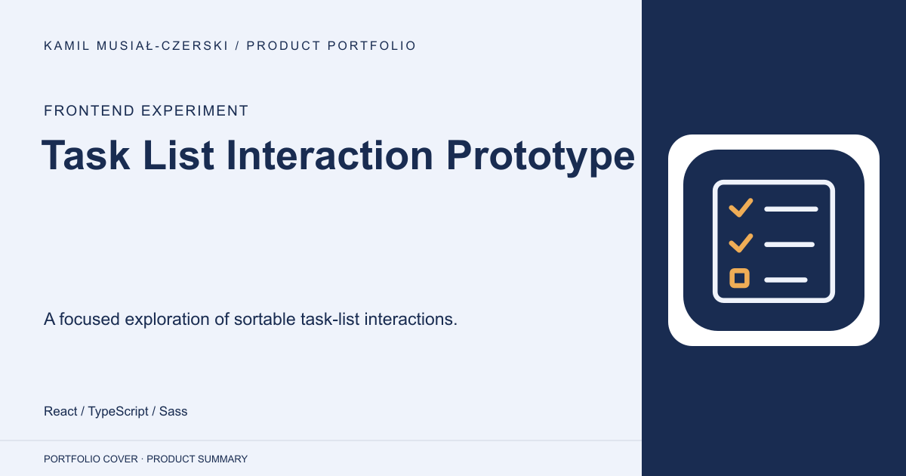
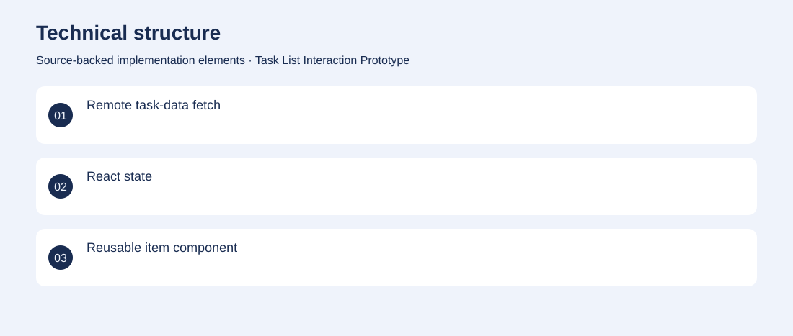

# Task List Interaction Prototype

A focused exploration of sortable task-list interactions.

**Frontend experiment · Small archived UI experiment; no server-side task persistence verified.**

Explore how a typed React interface can retrieve, order and update a list of tasks.

The interface fetches task records, offers sorting controls and updates completion state locally. Implemented task components, typed record props, data loading and client-side completion controls.

Small archived UI experiment; no server-side task persistence verified.

## Problem

Explore how a typed React interface can retrieve, order and update a list of tasks.

## Solution

The interface fetches task records, offers sorting controls and updates completion state locally.

## My contribution

Implemented task components, typed record props, data loading and client-side completion controls.

## Technology

React; TypeScript; Sass

## Technical structure

Remote task-data fetch; React state; Reusable item component

## Visuals

Portfolio cover and new project marks are editorial artwork. Only product views explicitly identified as captures represent screenshots.

[Complete portfolio](../README.md)
