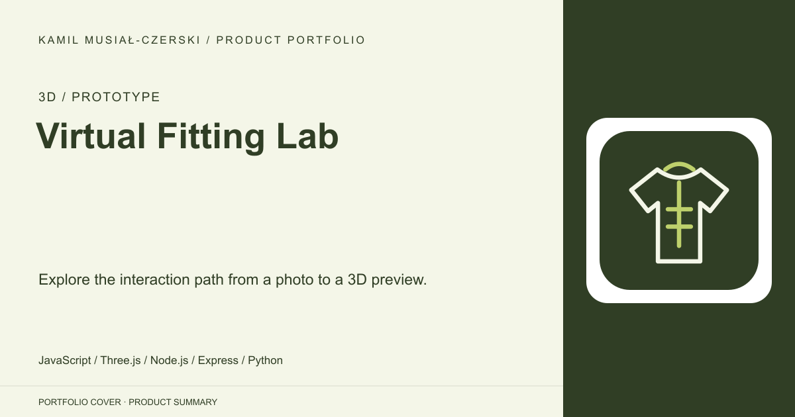
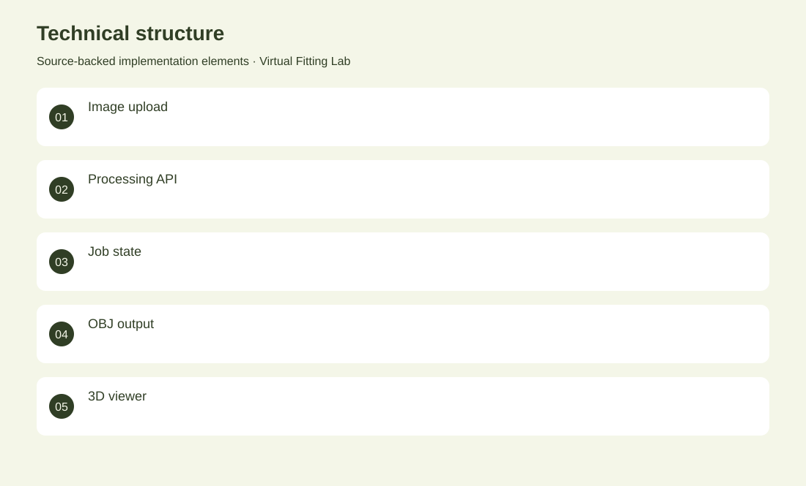

# Virtual Fitting Lab

Explore the interaction path from a photo to a 3D preview.

**3D / Prototype · Interaction prototype**

Express and Flask services produce a simplified textured placeholder mesh for a Three.js viewer. Implemented the upload pipeline, processing service and textured placeholder-mesh preview.

## Problem

A virtual-fitting workflow needs a clear path from user input to interactive 3D output.

## Solution

Express and Flask services produce a simplified textured placeholder mesh for a Three.js viewer.

## My contribution

Implemented the upload pipeline, processing service and textured placeholder-mesh preview.

## Technology

JavaScript; Three.js; Node.js; Express; Python; Flask; Pillow

## Technical structure

Image upload; Processing API; Job state; OBJ output; 3D viewer

## AI capabilities

3D reconstruction was planned, not implemented

## Visuals

Portfolio cover and new project marks are editorial artwork. Only product views explicitly identified as captures represent screenshots.

[Complete portfolio](../README.md)
