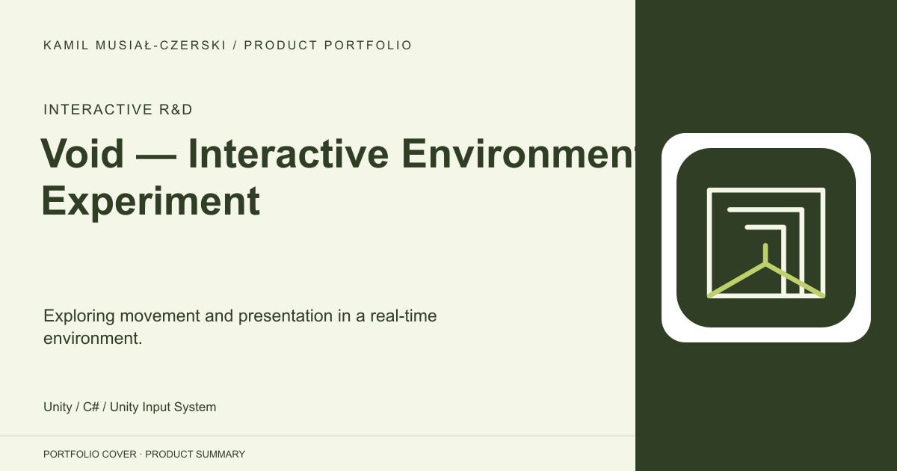
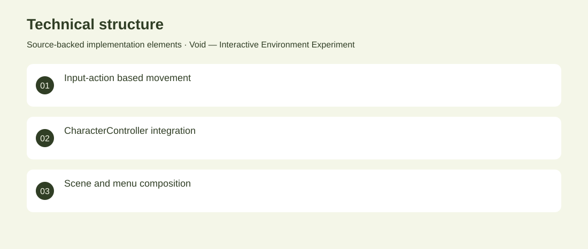

# Void — Interactive Environment Experiment

Exploring movement and presentation in a real-time environment.

**Interactive R&D · Archived technical experiment**

The repository contains authored player-input code and scene/menu iteration alongside third-party environment assets. This entry presents the custom interaction experiment without claiming authorship of bundled terrain, shaders or art.

## Problem

A real-time environment needs a usable interaction layer before its visual ideas can be explored.

## Solution

Implemented player movement using the Unity Input System and iterated on scene and menu presentation.

## My contribution

Custom player interaction and scene/menu prototyping; environment assets are third-party.

## Technology

Unity; C#; Unity Input System

## Technical structure

Input-action based movement; CharacterController integration; Scene and menu composition

## Visuals

Portfolio cover and new project marks are editorial artwork. Only product views explicitly identified as captures represent screenshots.

[Complete portfolio](../README.md)
