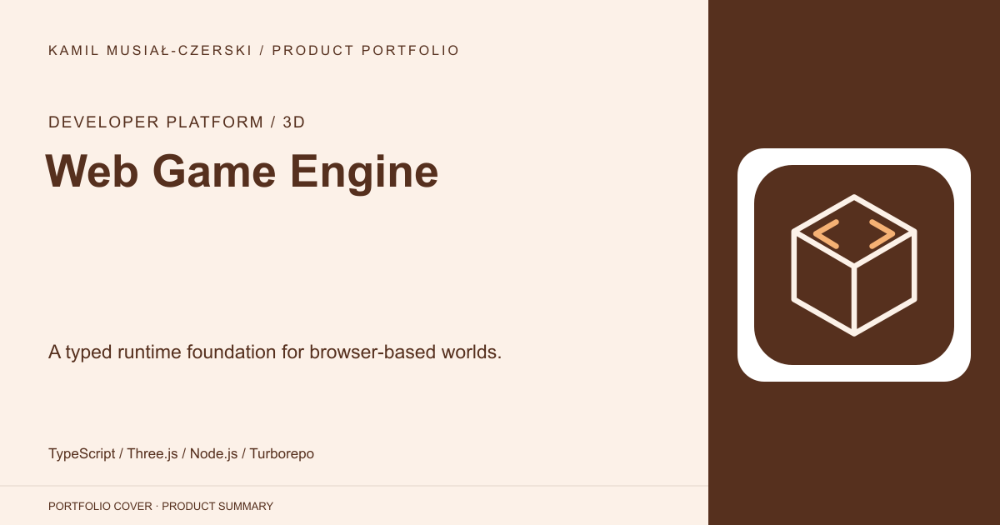
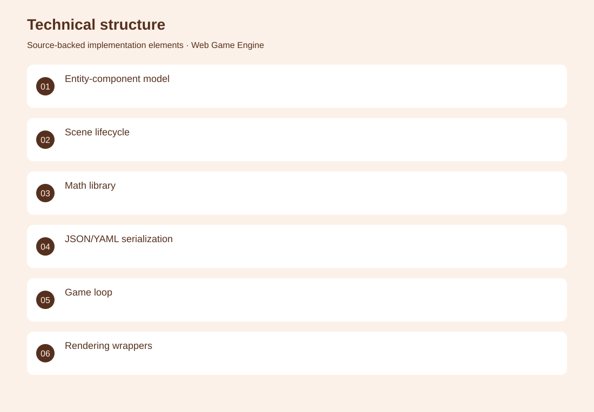
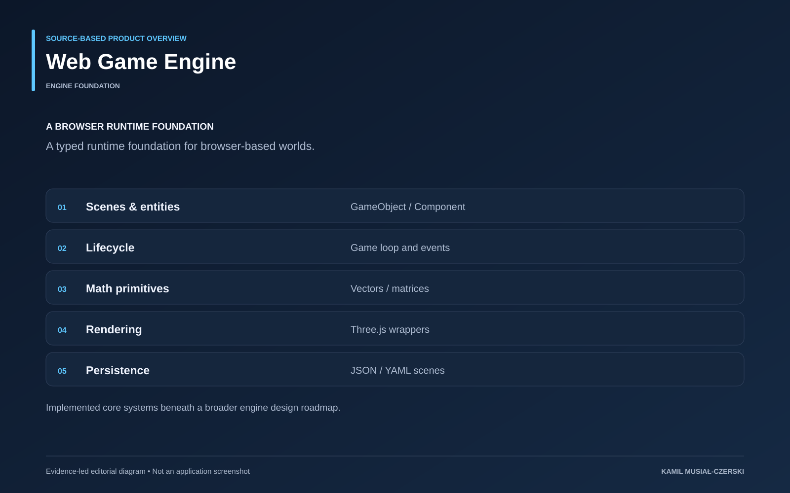

# Web Game Engine

A typed runtime foundation for browser-based worlds.

**Developer platform / 3D · Engine foundation**

A modular engine foundation separates scene data, lifecycle, rendering, events and persistence. Implemented entity-component primitives, lifecycle management, mathematical utilities and scene serialization.

## Problem

Browser-based interactive worlds benefit from reusable runtime and scene abstractions.

## Solution

A modular engine foundation separates scene data, lifecycle, rendering, events and persistence.

## My contribution

Implemented entity-component primitives, lifecycle management, mathematical utilities and scene serialization.

## Technology

TypeScript; Three.js; Node.js; Turborepo

## Technical structure

Entity-component model; Scene lifecycle; Math library; JSON/YAML serialization; Game loop; Rendering wrappers

## Visuals

Portfolio cover and new project marks are editorial artwork. Only product views explicitly identified as captures represent screenshots.

[Complete portfolio](../README.md)

