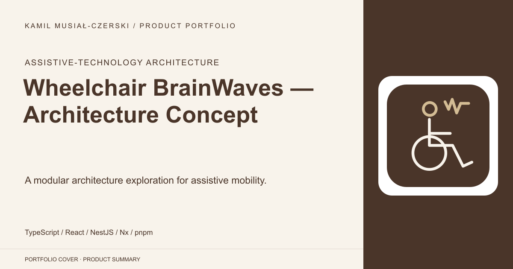
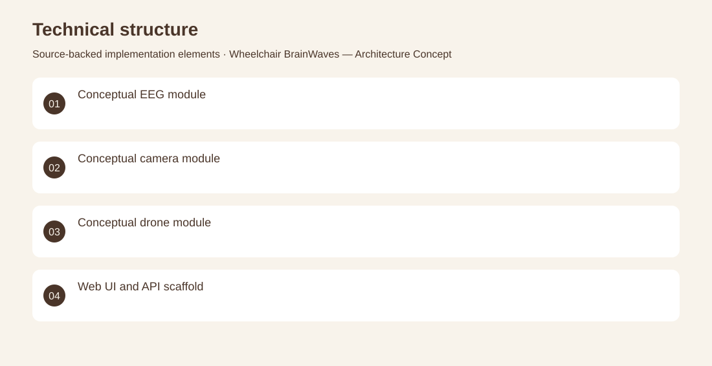

# Wheelchair BrainWaves — Architecture Concept

A modular architecture exploration for assistive mobility.

**Assistive-technology architecture · Architecture concept and software scaffold only. Hardware control, EEG interpretation and deployed assistive-device operation are not verified.**

Explore how sensing, control and user interaction could fit together in an assistive-mobility system.

Architecture documents and diagrams outline brainwave, camera and drone modules, supported by an initial React/NestJS monorepo and development setup. Produced the modular architecture concept, documented module responsibilities and established the initial application structure.

Architecture concept and software scaffold only. Hardware control, EEG interpretation and deployed assistive-device operation are not verified.

## Problem

Explore how sensing, control and user interaction could fit together in an assistive-mobility system.

## Solution

Architecture documents and diagrams outline brainwave, camera and drone modules, supported by an initial React/NestJS monorepo and development setup.

## My contribution

Produced the modular architecture concept, documented module responsibilities and established the initial application structure.

## Technology

TypeScript; React; NestJS; Nx; pnpm; Docker

## Technical structure

Conceptual EEG module; Conceptual camera module; Conceptual drone module; Web UI and API scaffold

## Visuals

Portfolio cover and new project marks are editorial artwork. Only product views explicitly identified as captures represent screenshots.

[Complete portfolio](../README.md)
