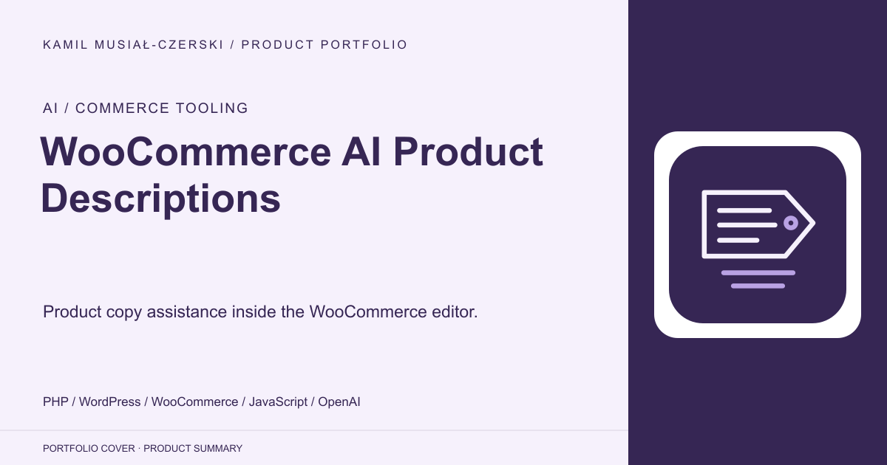
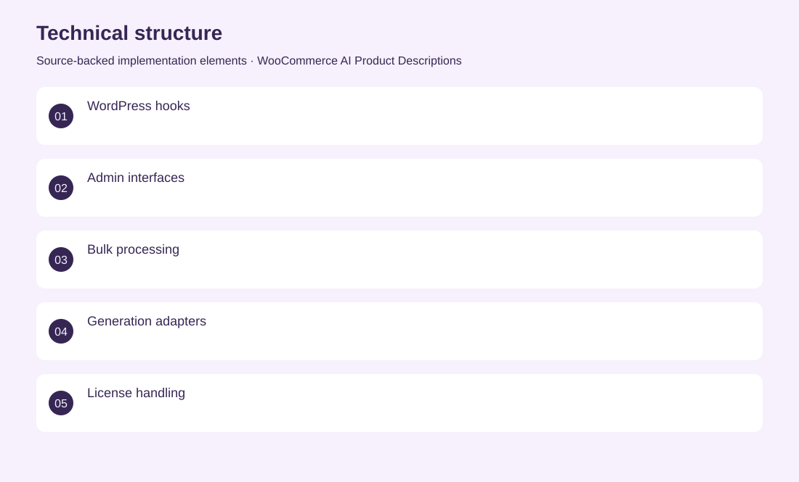
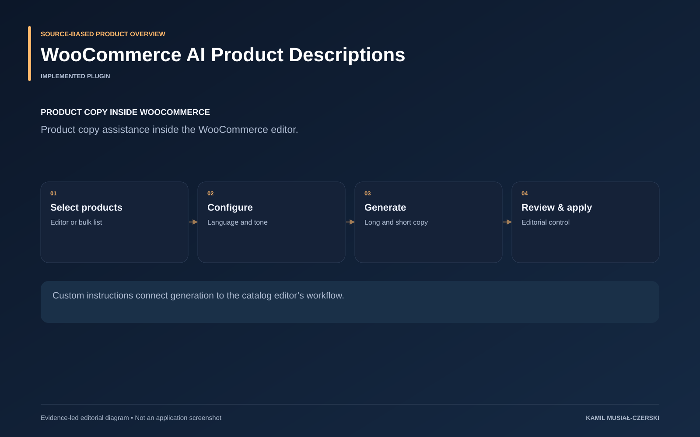

# WooCommerce AI Product Descriptions

Product copy assistance inside the WooCommerce editor.

**AI / Commerce tooling · Implemented plugin**

The plugin connects existing product information to long- and short-description generation. Product-editor controls and bulk processing let catalog editors choose language, tone and custom instructions, then preview and apply results within WooCommerce.

## Problem

Catalog teams repeat description-writing tasks across many products.

## Solution

Product-editor controls and bulk workflows connect existing product data to configurable generation and review.

## My contribution

Implemented product-editor controls, bulk generation, language and tone configuration, and the product-description provider adapter.

## Technology

PHP; WordPress; WooCommerce; JavaScript; OpenAI

## Technical structure

WordPress hooks; Admin interfaces; Bulk processing; Generation adapters; License handling

## AI capabilities

Long and short product descriptions; Language and tone controls

## Visuals

Portfolio cover and new project marks are editorial artwork. Only product views explicitly identified as captures represent screenshots.

[Complete portfolio](../README.md)

