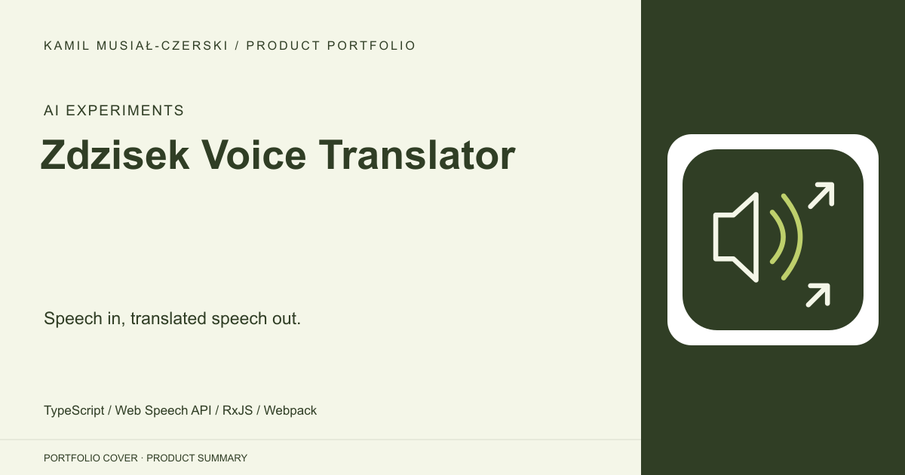
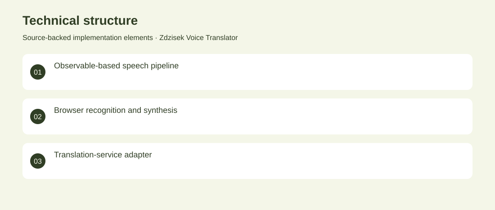

# Zdzisek Voice Translator

Speech in, translated speech out.

**AI Experiments · Archived AI integration experiment**

A browser-based voice-translation experiment that connects speech recognition to translation and spoken output. RxJS coordinates the flow from recognised words to Polish-language speech synthesis. Implemented browser speech wrappers and an asynchronous translation pipeline. Archived AI integration experiment. No adoption, revenue or deployment claims are inferred from the repository.

## Problem

Voice interfaces need a bridge between recognition, language conversion and an audible response.

## Solution

Implemented browser speech wrappers and an asynchronous translation pipeline.

## My contribution

TypeScript integration of speech recognition, translation and speech synthesis.

## Technology

TypeScript; Web Speech API; RxJS; Webpack

## Technical structure

Observable-based speech pipeline; Browser recognition and synthesis; Translation-service adapter

## AI capabilities

Browser speech recognition; Machine-translation integration; Speech synthesis

## Visuals

Portfolio cover and new project marks are editorial artwork. Only product views explicitly identified as captures represent screenshots.

[Complete portfolio](../README.md)
